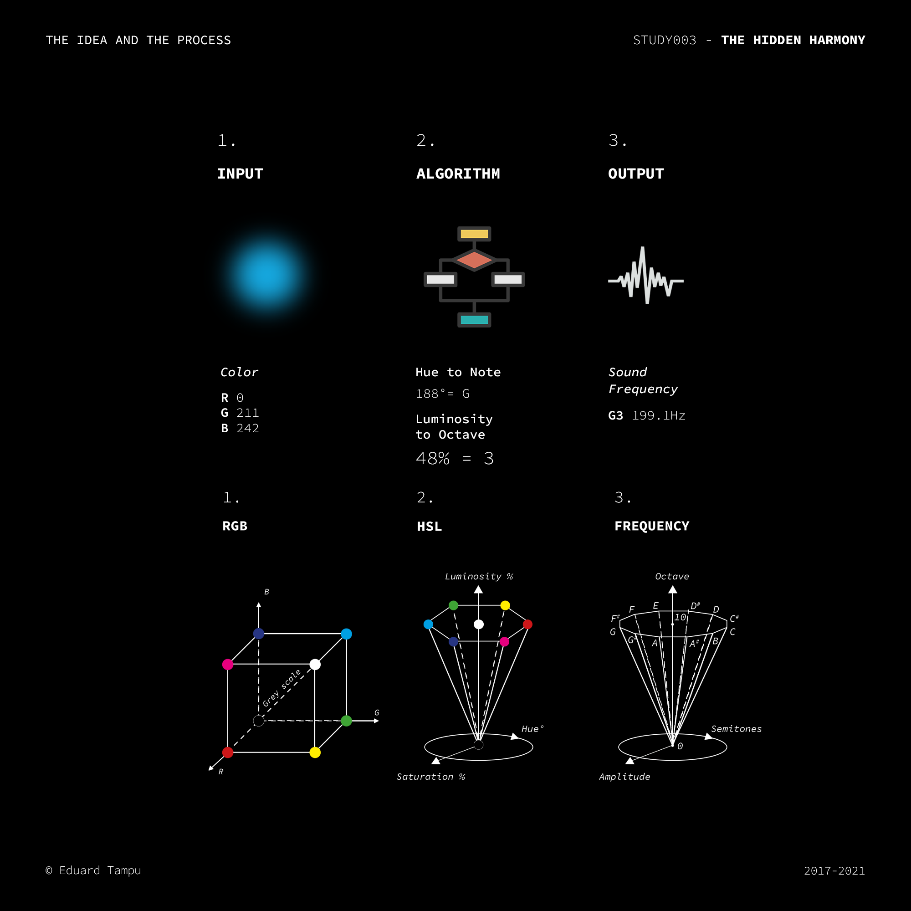

# STUDY003 - The Hidden Harmony
### A DIGITAL SYNESTHETIC SYSTEM (2017 - 2021)

In time the relation between colours and sound has been studied with more than one theory. From Greeks with Aristotle (On Colours), to Isaac Newton (Opticks) and many other artists like Kandinsky (On the Spiritual in Art) and Skrjabin (Prometheus: The Poem of Fire). The relation between colours and sounds I developed is not based on a scientific description of these two realms, but more on my personal view on how these interract. The series of studies under The Hidden Harmony tries to augment our perception. What if it would be possible to listen to a painting or see colours while listening to music?

### The idea
Create a system of communication between the color and sound spaces that can be used to realize different installations and creative systems.
### The method
The method is designed to create a one-to-one relation between colours and sound frequencies: luminance to octave and hue value to the 12 notes. It is useful to go through the HSL representation of the color before reaching the sound frequency domain. Note that the reverse is also possible.

##### Inside the process 
Starting by considering the extension of the two sensorial events, we can create a relation between them. If we calculate the intensity of the Input colour, than is possible to transpose this value inside the octave domain. For these steps, it will be needed to use the HSL colour representation, because it will make the process more easier and less expensive in terms of code.	
