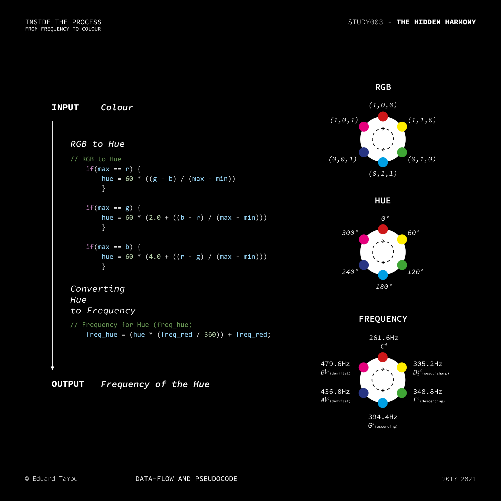

## Introduction

**WHAT IS *THE HIDDEN HARMONY?*** 

Essentialy, is *a digital synesthetic system*, a system of communication between the color and sound spaces that can be used to realize different installations and creative systems.

In time the relation between colours and sound has been studied with more than one theory. From Greeks with **Aristotle** (*On Colours*), to **I. Newton** (*Opticks*) and many other artists like **W. Kandinsky** (*On the Spiritual in Art*) and **A. Skrjabin** (*Prometheus: The Poem of Fire*). The relation between colours and sounds I developed is not based on a scientific description of these two realms, but more on my personal view on how these interract. The series of studies under The Hidden Harmony tries to augment our perception. What if it would be possible to listen to a painting or see colours while listening to music?

**The method** 

The method is designed to create a one-to-one relation between colours and sound frequencies: luminance to octave and hue value to the 12 notes. It is useful to go through the HSL representation of the color before reaching the sound frequency domain. Note that the reverse is also possible.

<p  align="center">

</p>


## Inside the conversion

For the realization of this system is used as main software [Max/MSP](https://cycling74.com/products/max), inside of which a JavaScript code operates the conversion from colour to frequency. 

To begin with, the function needs as input from Max/MSP an RGB value, usually being between 0 and 255, it is better to scale those values between 0 and 1:
```JavaScript
function colorSet(in_r, in_g, in_b) {
	
	// Scaling the RGB values between 0 and 1

	r = in_r / 255.0;
	g = in_g / 255.0;
	b = in_b / 255.0;
...
}
```

After having scaled the input values, two are the main blocks needed for the purpose of this conversion: (1) from the Luminosity evaluates the Octave and (2) from the Hue sets a Central Frequency.

##### Luminosity to Octave

<p  align="center">

</p>

Starting by considering the extension of the two sensorial events, we can create a relation between them. If we calculate the intensity of the input colour, than is possible to transpose this value inside the octave domain. To find the Luminosity value from an RGB value, it is required to evaluate the maximum and minimum between the RGB values: 
```JavaScript 
max = Math.max(r,g,b);	
min = Math.min(r,g,b);

// Luminosity = (min + max) / 2 
  l = (min + max) / 2;
```
Therefore, the obtained value is interpolated to the ten octaves in which the human hearing is enclosed. Note that, the luminosity value of 0.5 identify those colours named *Pure Saturated Colours*, or *Hues*. This is used to relize a fix point in the convertion, not only for this step, but also in the consideration of the relation between Hue and the 12 semitones that will be analized in the following:
```JavaScript 
if (l < 0.5) {
	o = (4 / 0.5) * l;
}
if (l == 0.5) {
	o = 4;
}
if (l > 0.5) {
	o = ((5 / 0.5) * (l - 0.5) + 5);
}
	
o = Math.floor(o); 
```


##### Hue to Central Frequency

<p  align="center">

</p>

The RGB sequence can be seen like an actual *musical scale* or rather, the pattern that is created can be linearly interpolate within one octave. In other terms, this sequence is directly related to the consideration of Hue value, evaluated in 360 degrees. For doing this, it is also needed to set a starting point for the relationship. I decided to set a stable relationship between the red-colour and C4 (at A4 440Hz, C4  261.6Hz). As mentioned before, the reason why it is used a note of the fourth octave is related to a series of balances between the two dimensions. 

```JavaScript 
// Hue Evaluation
if(max == r) {
	hue = 60 * ((g - b) / (max - min))
} 
if(max == g) {
	hue = 60 * (2.0 + ((b - r) / (max - min)))
} 
if(max == b) {
	hue = 60 * (4.0 + ((r - g) / (max - min)))
}
if(isNaN(hue) == 1) {
	hue = 0;
}
if(hue < 0) {
	hue = hue + 360;
}
if(max == min) {
	hue = 0;
}

// Evaluation of the Central Frequency 

central_frequency = (hue.toFixed(0) * (freq_red / 360)) + freq_red;
```
The `freq_red` constant is defined with:
```JavaScript
const a4 = 440; // (Hz)
const freq_red = a4 * (Math.pow(2, (-9 / 12))); 
```
The formula used is explained [here](https://en.wikipedia.org/wiki/Musical_note).

The final result is obtained by transposing the central frequency to the octave resulted from the luminosity:
```JavaScript
if (o < 4) {
	output_frequency = central_frequency / Math.pow(2, (4 - o));
}
if(o >= 4 & o < 5) {
	output_frequency = central_frequency;
}
if (o >= 5) {
	output_frequency = central_frequency * Math.pow(2, o - 4);
}
```

The math behind the steps that are used to evaluate the Luminosity and the Hue from the RGB value can be found [here](https://en.wikipedia.org/wiki/HSL_and_HSV).

Note. The saturation can be implemented in the process and can be relate to the amplitude of a frequency as follow:
```JavaScript
// Saturation Evaluation
if(l <= 0.5) {
	s = (max - min) / (max + min);
	} else {
if(l > 0.5) {
	s = (max - min) / (2.0 - (max - min));
	}
}
if(isNaN(s) == 1) {
	s = 0;
}

amplitude = saturation;
```
