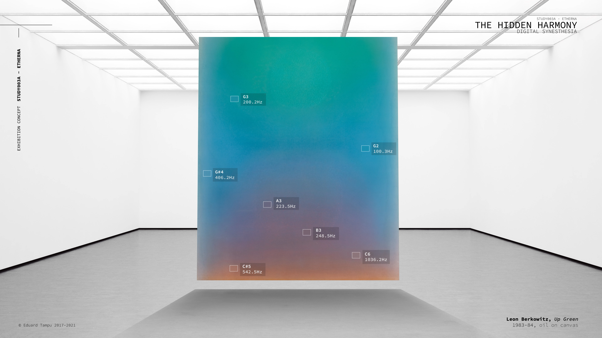

<c>
THE HIDDEN HARMONY 
</c> 

# Introduction

This study research the realization of *a digital synesthetic system*, a system of communication between the colour and sound spaces that can be used to realize different installations and creative systems.

<h4 align="center" > 
"Colour is the keyboard, the eyes are the harmonies,   the soul is the piano with many strings. 
  The artist, is the hand that plays,
  touching one key or another 
  to cause vibrations in the soul.

 - Wasilly Kandinsky -   
From "On the spiritual in art"
 </h4>

In time the relation between colours and sound has been studied with more than one theory. From Greeks with **Aristotle** (*On Colours*), to **I. Newton** (*Opticks*) and many other artists like **W. Kandinsky** (*On the Spiritual in Art*) and **A. Skrjabin** (*Prometheus: The Poem of Fire*). The relation between colours and sounds I developed is not based on a scientific description of these two realms, but more on my personal view on how these interact. The series of studies under The Hidden Harmony tries to augment our perception. What if it would be possible to listen to a painting or see colours while listening to music?

**The method** 

The method is designed to create a one-to-one relation between colours and sound frequencies: luminance to octave and hue value to the 12 notes. It is useful to go through the HSL representation of the colour before reaching the sound frequency domain. Note that the reverse is also possible.

For instance, the method explained under shows how, from an initial colour it is possible to obtain a frequency, process applied to the [Study003A - Etherna](https://youtu.be/rYiHrotcdxU). Reversing the process, with the Study003B that is currently under development, can be realized a system that, express through a colour a specific frequency.

