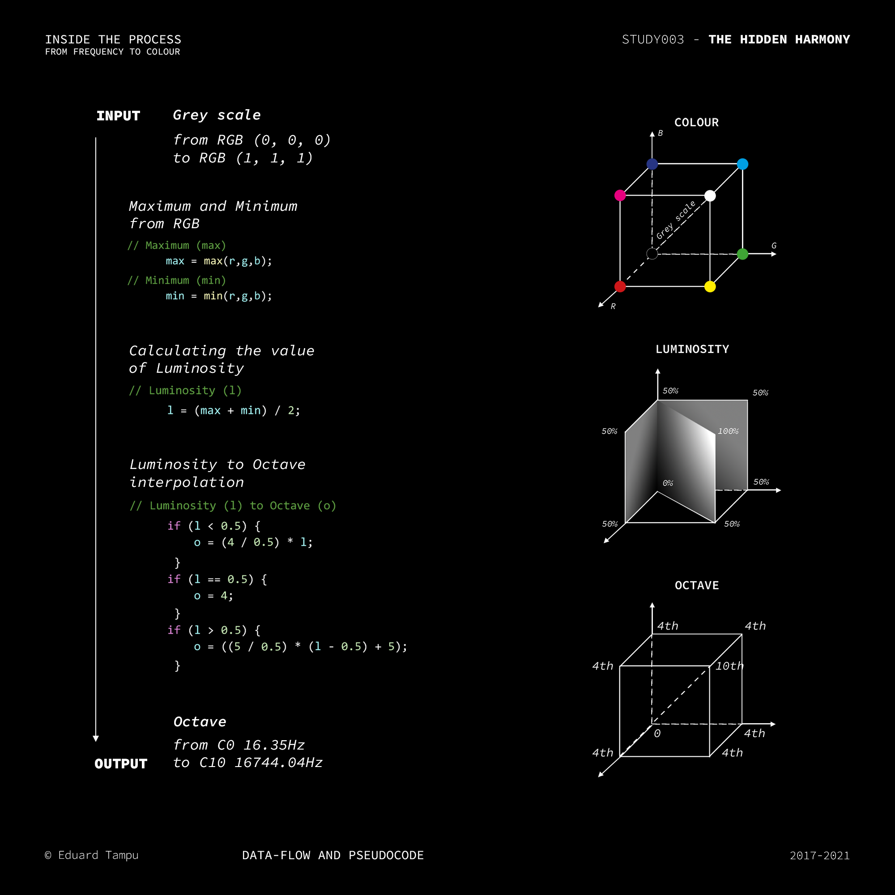

<c>
COLOUR TO FREQUENCY
</c> 

# The process

For the realization of this system is used as main software [Max/MSP](https://cycling74.com/products/max), inside of which a JavaScript code operates the conversion from colour to frequency. [Here](https://docs.cycling74.com/max8/vignettes/jsintro) can be found more about JavaScript operating inside Max/MSP.

To begin with, the function needs as input from Max/MSP an RGB value, depending on the value that is used, it might be needed to scale those values between 0 and 1 for a better approach to the conversion:
```JavaScript
function colorSet(in_r, in_g, in_b) {
	
	// Scaling the RGB values between 0 and 1

	r = in_r / 255.0;
	g = in_g / 255.0;
	b = in_b / 255.0;
...
}
```

After having scaled the input values, two are the main blocks needed for the purpose of this conversion: (1) from the [luminosity evaluates the octave](#Luminosity-to-Octave) and (2) from the [hue sets a central frequency](#Hue-to-Central-Frequency). 

The [final result](#Final-Step) is obtained from the combination of these two blocks.

## Luminosity to Octave

Starting by considering the extension of the two sensorial events, we can create a relation between them. If we calculate the intensity of the input colour, than is possible to transpose this value inside the octave domain. To find the Luminosity value from an RGB value, it is required to evaluate the maximum and minimum between the RGB values: 
```JavaScript 
// maximum and minimum of the RGB colour space

max = Math.max(r,g,b);	
min = Math.min(r,g,b);

// Luminosity = (min + max) / 2 

  l = (min + max) / 2;
```
Therefore, the obtained value is interpolated to the ten octaves in which the human hearing is enclosed. 

Note that, the luminosity value of 0.5 identify those colours named *Pure Saturated Colours*, or *Hues*. This is used to realize a fix point in the conversion, not only for this step, but also in the consideration of the relation between Hue and the 12 semitones that will be analysed in the following:
```JavaScript
// Luminosity interpolation to Octaves 

if (l < 0.5) {
	o = (4 / 0.5) * l;
}
if (l == 0.5) {
	o = 4;
}
if (l > 0.5) {
	o = ((5 / 0.5) * (l - 0.5) + 5);
}
	
o = Math.floor(o); 
```
Here is a graphical explanation of this block that can help understanding the transformation that occurs:

<p align="center">

</p>


## Hue to Central Frequency

The RGB sequence can be seen like an actual *musical scale* or rather, the pattern that is created can be linearly interpolate within one octave. In other terms, this sequence is directly related to the consideration of Hue value, evaluated in 360 degrees. For doing this, it is also needed to set a starting point for the relationship. I decided to set a stable relationship between the red-colour and C4 (at A4 440Hz, C4  261.6Hz). As mentioned before, the reason why it is used a note of the fourth octave is related to a series of balances between the two dimensions. 

```JavaScript 
// Hue Evaluation

if(max == r) {
	hue = 60 * ((g - b) / (max - min))
} 
if(max == g) {
	hue = 60 * (2.0 + ((b - r) / (max - min)))
} 
if(max == b) {
	hue = 60 * (4.0 + ((r - g) / (max - min)))
}
if(isNaN(hue) == 1) {
	hue = 0;
}
if(hue < 0) {
	hue = hue + 360;
}
if(max == min) {
	hue = 0;
}

// Evaluation of the Central Frequency 

central_frequency = (hue.toFixed(0) * (freq_red / 360)) + freq_red;
```
The value for the constant `freq_red` is defined by:
```JavaScript
const a4 = 440; // (Hz)
const freq_red = a4 * (Math.pow(2, (-9 / 12))); 
```
Below, a graphical representation make easier to see the repetition that occurs in the RGB colour space and the relation to Hue and the 12 semitones:

<p  align="center">

</p>

## Final Step

The final result is obtained by transposing the central frequency to the octave resulted from the luminosity:
```JavaScript
// Final result evaluation 

if (o < 4) {
	output_frequency = central_frequency / Math.pow(2, (4 - o));
}
if(o >= 4 & o < 5) {
	output_frequency = central_frequency;
}
if (o >= 5) {
	output_frequency = central_frequency * Math.pow(2, o - 4);
}
```

Note. The saturation can be implemented in the process and can be linearly used as amplitude of a frequency as follow:
```JavaScript
// Saturation Evaluation

if(l <= 0.5) {
	s = (max - min) / (max + min);
	} else {
if(l > 0.5) {
	s = (max - min) / (2.0 - (max - min));
	}
}
if(isNaN(s) == 1) {
	s = 0;
}

amplitude = saturation;
```
### Links and Materials 

The math behind the steps that are used to evaluate the Luminosity and the Hue from the RGB value can be found [here](https://en.wikipedia.org/wiki/HSL_and_HSV).

The formula used to find the note C4 from A4 is explained [here](https://en.wikipedia.org/wiki/Musical_note).

### License 

[](https://opensource.org/licenses/MIT)

