# Introduction

The series of *studies* starts with the correlation between colours and sounds. The name of this study, *Etherna*, anticipates what is its purpose: the realization of an eternal 'soundtrack', that could be a complement for the fruition of a particular figurative work. 

The study can be seen as (1) a stand-alone audiovisual work or (2) as a sound installation inside a museum, a static or interactive realization. 

<h3  align="center"> "Art is a sort of an experimental station<p> in which one tries out living."  <p> - John Cage - </h3>

### Tools and ideas

The project runs inside Max/MSP, using different modules, such as: Jitter operators, MC signal operators, JS objects. The use of the patch for the moment is to create an environment in which is possible to experiment with this system, for further possible realizations outside the Max/MSP environment. 

The system develops two possible applications: (1) a [manual selection of colours]() directly from the painting, and (2) based on a [resampling of the painting]() and choice of two regions.

Below, the patch in presentation mode.

<p  align="center">
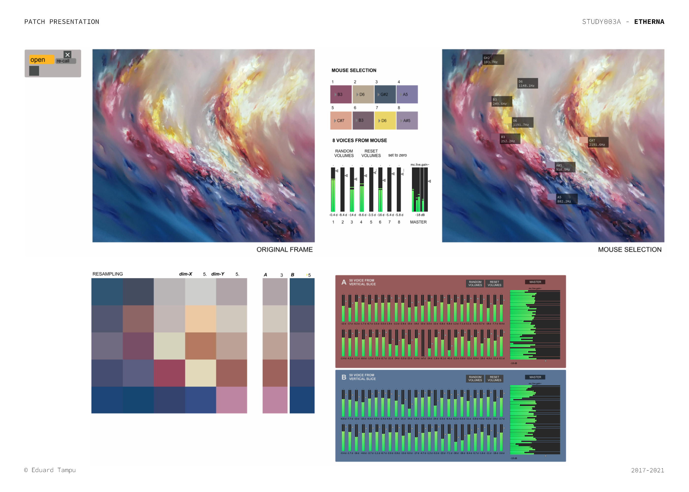
</p>

## General Settings

To begin with, the patch requires to import an image (for the purpose of the project the ideal material would be a painting), that  thanks to the ```jitter``` modules, will sets a matrix of colours to work with.

All the images are displayed inside the patch thanks to ```jit.pwindow```. To allow a proper display of the image is needed to rescale it, maintaining the aspect ratio and giving also back an information on the dimension of the matrix. 

<p  align="center">
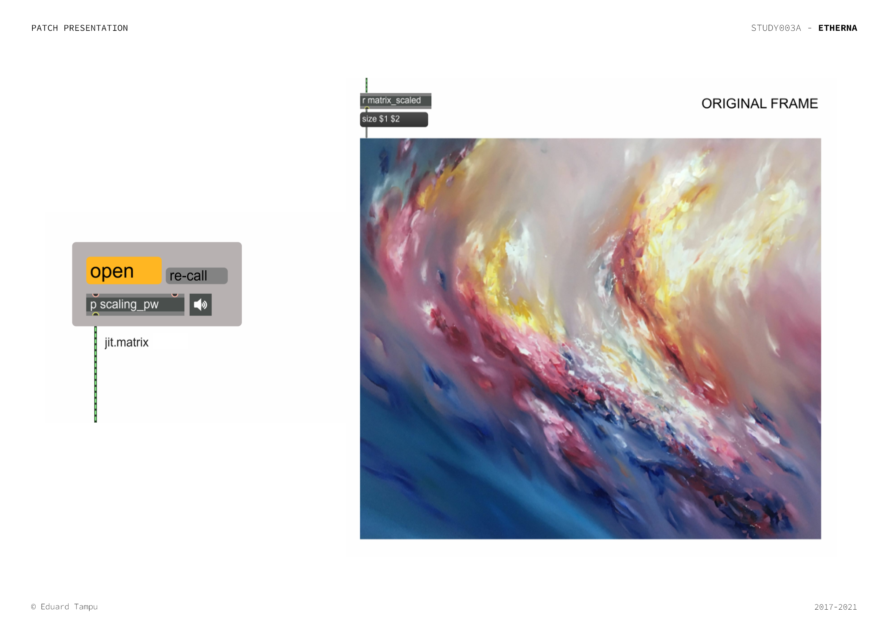
</p>

## Manual selection of colours

The manual selection of colours directly on the painting works with five main steps: in order to interact with the painting is needed to  (1) [set-up a ```jit.pwindow```](#set-up-the-jitpwindow) that sends the mouse position. Then (2) a process [retrieves the colour information](#retriving-the-colours) specified by the mouse position on the image, and (3) a [gating system](#gating-system-and-convertion) stores the colour information and converts it to frequency. (4) A [visual feedback](#visual-feedback) gives a response to the user about the colour selected and the corresponding frequency. Finally (5) the [sound realization](#sound-realization) of the selected colours. 

<p  align="center">
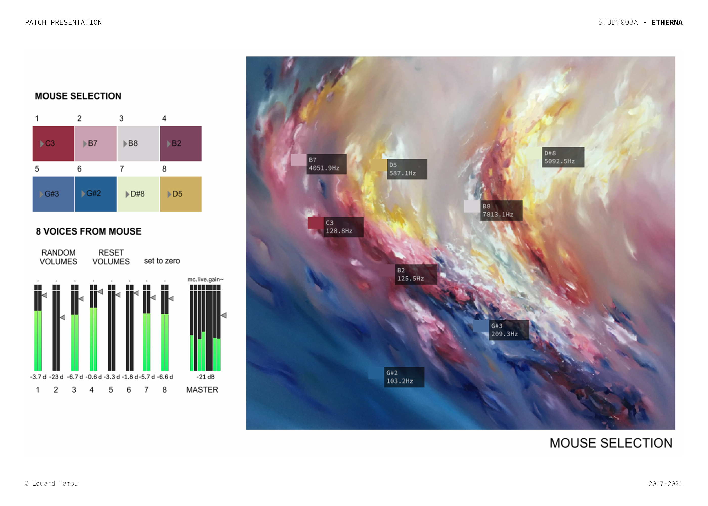
</p>

### Set-up the jit.pwindow

To begin with, the ```jit.pwindow``` receives the matrix information related to the imported image and the size of the window. In response outputs and sends the mouse position on it. 

<p  align="center">
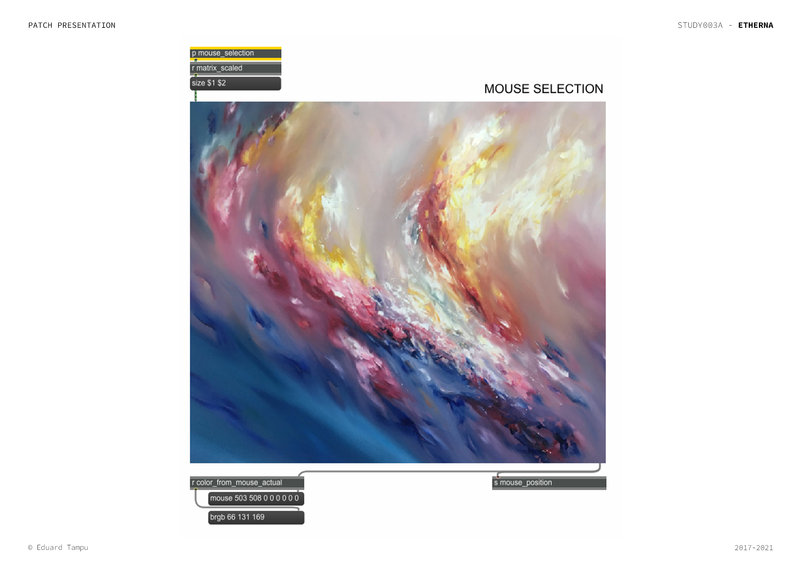
</p>

### Retriving the colours 

This process is encapsulated inside the sub-patch ```mouse_selection```, in which is received the matrix information relative to the imported image and outputted as it is to the jit.pwindow. The sub-patch also operate to obtain the information relative to the three RGB colour planes by splitting the matrix. 

The three splitted matrices receive, thanks to the ```set $1 $2```, the information on the position of the mouse and emit the information relating to the color in that position. This sub-patch ultimately sends the information relative to the ```colour_from_mouse```.

<p  align="center">
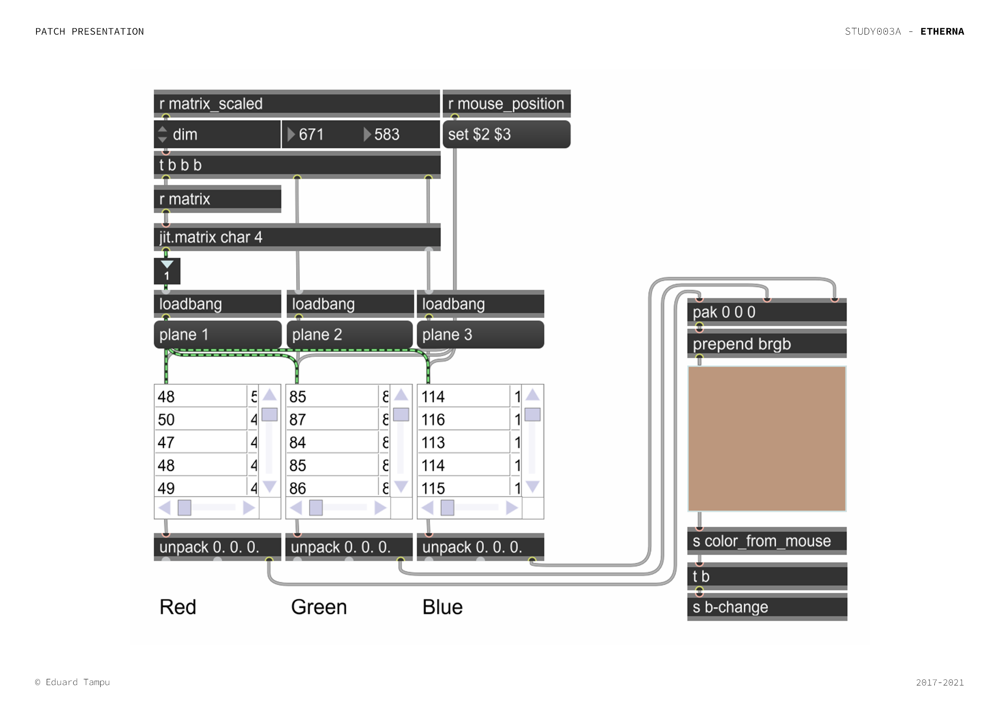
</p>

<h3> Note </h3>

The next two steps, [gating system](#gating-system-and-convertion) and [visual feedback](#visual-feedback), are encapsulated respectively inside the ```mouse_selection_boxes``` and ```cube_on_canvas``` subpatches.

<p  align="center">
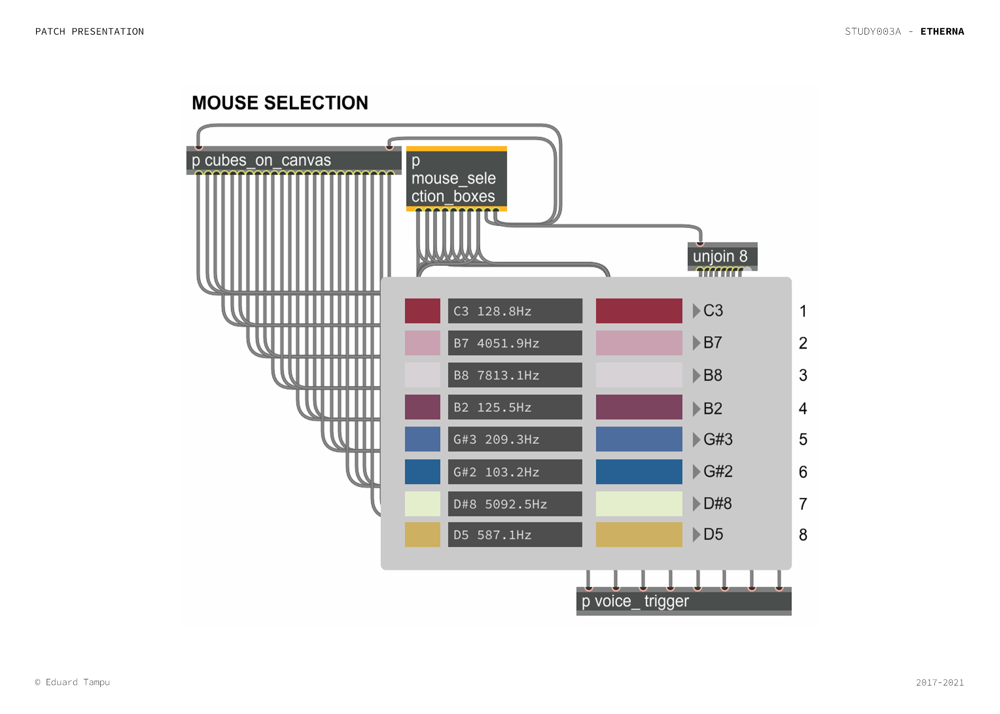
</p>

### Gaiting system and convertion

This process is realized to make possible to the system to store momentarily the colour information received by the previous step. To work the system requires the interaction of the user, that has to specify, before positioning the mouse to the colour that is wanted to store, the voice that has to store that value, by pressing the relative number on the keyboard. 

Then, two are the developments: (1) to the colour value is prepended the line ‘brgb’ required for the visual feedback step and (2) ```join``` the values to operate the conversion, inside the ```conversion-block```.

Inside the ```conversion-block```, the information are then passed to the ```conversion_module``` that uses a ```js module``` with the code explained [here](../README.md), to pass from the RGB space to the sound frequency domain. 

<p  align="center">
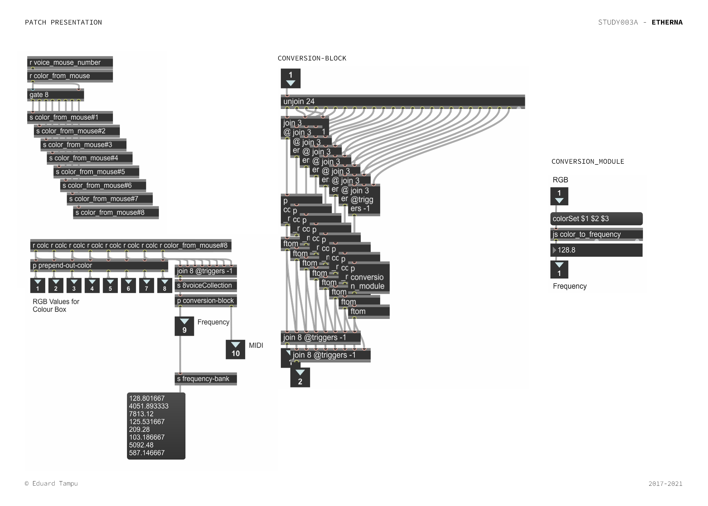
</p>

### Visual feedback

The visual feedback helps the user during the collection of the materials and monitoring the results of the process. It provides to the user a box filled with the selected colour, located where the mouse collected that value and the relative information about the  name of the note and the frequency. 

<p  align="center">
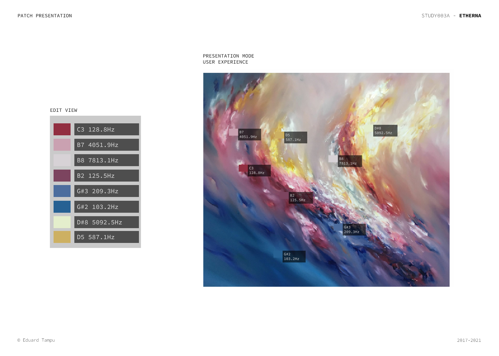
</p>

In order to achieve this the process as explained before, gates the values to the respective collector, and position the materials, color-filled box and note information, in the presentation mode of the patch thanks to the mouse position.

The sub-patch ```to_comment``` make possible the creation of a line that will be displayed inside the ```comment``` objects, thanks to the use of this code:

```JavaScript
var frequency, midi, o, m_0, n;
var noteArray = ["C", "C#", "D", "D#", "E", "F", "F#", "G", "G#", "A", "A#", "B"];


function getComment(midi_in, frequency_in){

    frequency = frequency_in;
    midi = midi_in;
    
	// Octave ID
	o = midi / 12;
	o = (Math.floor(o) - 1);
	
	// Note from 0 and 11
	m_0 = midi % 12;

	// Note selection
	n = noteArray[m_0];

	outlet(0, n + o + " " + frequency.toFixed(1) + "Hz");

}
```
Remember that this process is contained inside the sub-path ```cube_on_canvas```, as already mentioned.

<p  align="center">
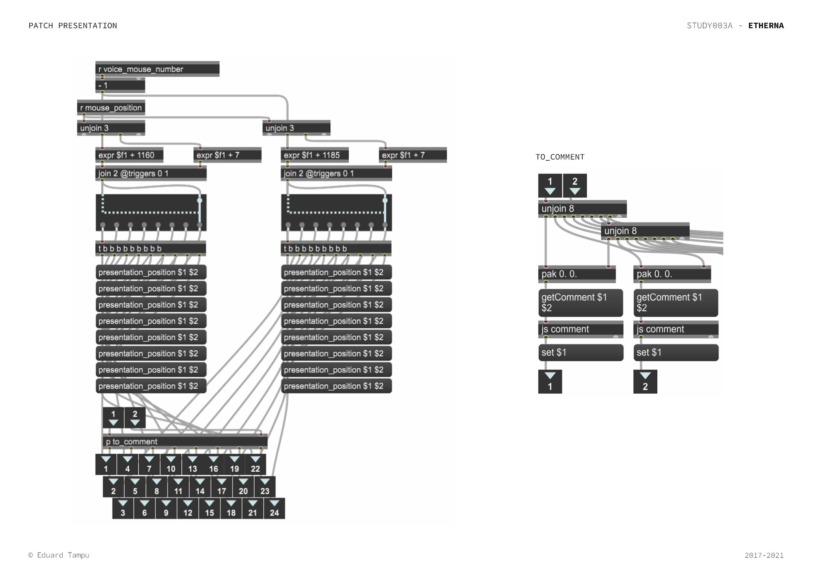
</p>

### Sound realization 

The final step is generating sound from the obtained frequencies. 

<p  align="center">
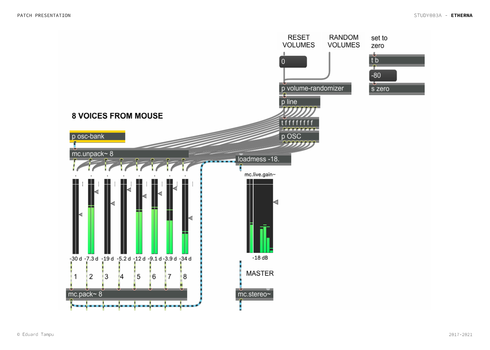
</p>

In this case, for the entire project are used ```cycle ~``` modules, or sine waves. This do not imply that other sound forms can be used, and this also extends to the uso of external softwares. Other applications of this patch see for example the use of midi messages to communicate with Ableton Live, opening the process to broad sound possibilities.

Note. Some of the modules seen in the previous image are explained [here](#extras).

The ```osc-bank``` sub-patch, receive the ```frequency-bank```obtained during the [gating and conversion]() process and simply pass it through a sound module (```sound_fq```) and then apply an envelope (that can also be non-effective to the process).

The signals then are packed into a MC signal, that not only helps carrying the signals, but opens the patch to multichannel applications.

<p  align="center">
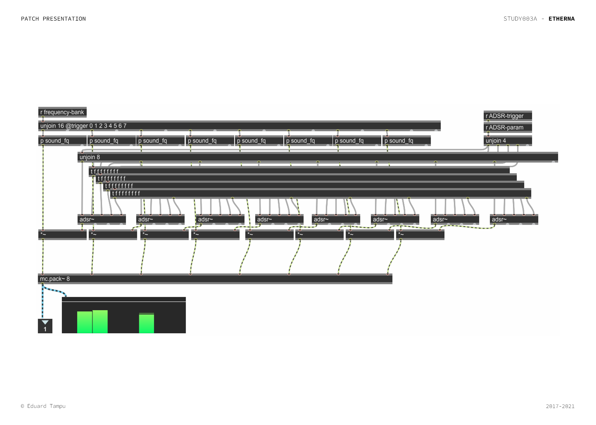
</p>


### Extras 