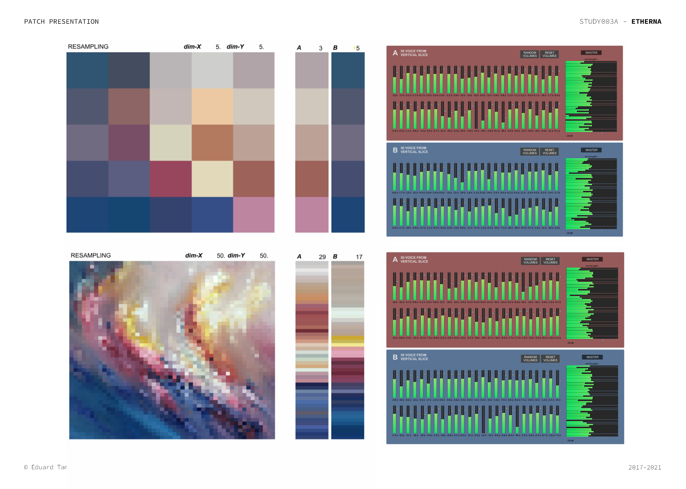
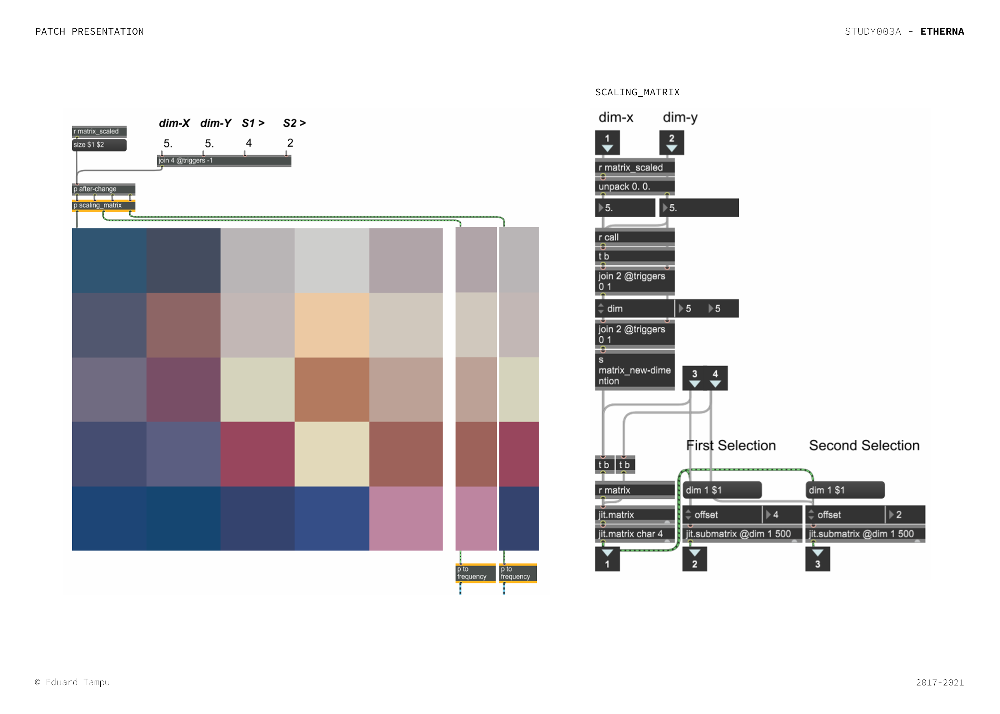
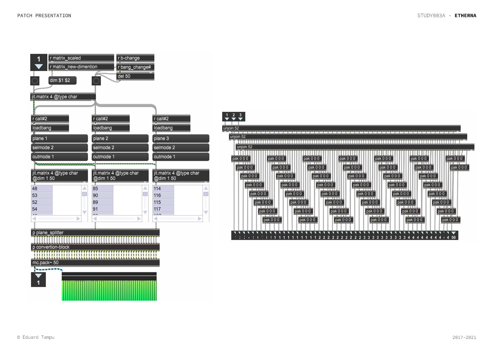
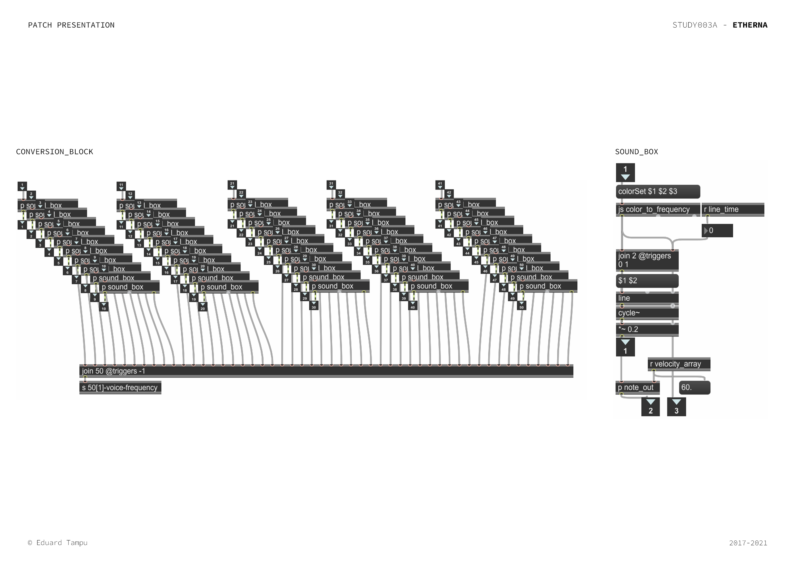
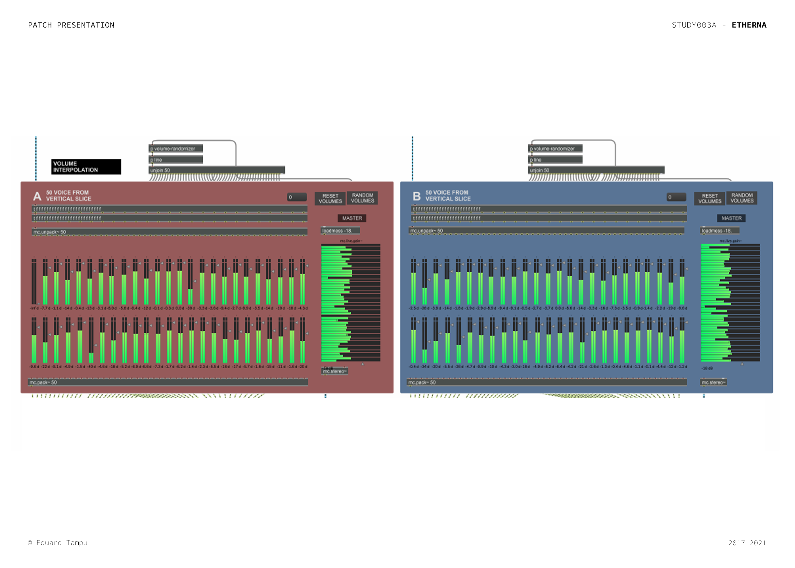
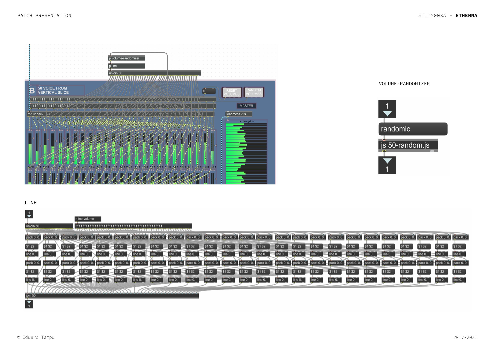

# Introduction

The series of *studies* starts with the correlation between colours and sounds. The name of this study, *Etherna*, anticipates what is its purpose: the realization of an eternal 'soundtrack', that could be a complement for the fruition of a particular figurative work. 

The study can be seen as (1) a stand-alone audiovisual work or (2) as a sound installation inside a museum, a static or interactive realization. 

<h3  align="center"> "Art is a sort of an experimental station<p> in which one tries out living."  <p> - John Cage - </h3>

### Tools and ideas

The project runs inside Max/MSP, using different modules, such as: Jitter operators, MC signal operators, JS objects. The use of the patch for the moment is to create an environment in which is possible to experiment with this system, for further possible realizations outside the Max/MSP environment. 

The system develops two possible applications: (1) a [manual selection of colours](#manual-selection-of-colours) directly from the painting, and (2) based on a [resampling of the painting]() and choice of two regions.

Below, the patch in presentation mode.

<p  align="center">

</p>

## General Settings

To begin with, the patch requires to import an image (for the purpose of the project the ideal material would be a painting), that  thanks to the ```jitter``` modules, will sets a matrix of colours to work with.

All the images are displayed inside the patch thanks to ```jit.pwindow```. To allow a proper display of the image is needed to rescale it, maintaining the aspect ratio and giving also back an information on the dimension of the matrix. 

<p  align="center">

</p>

# Manual selection of colours

The manual selection of colours directly on the painting works with five main steps: in order to interact with the painting is needed to  (1) [set-up a ```jit.pwindow```](#set-up-the-jitpwindow) that sends the mouse position. Then (2) a process [retrieve the colour information](#retrieving-the-colours) specified by the mouse position on the image, and (3) a [gating system](#gating-system-and-convertion) stores the colour information and converts it to frequency. (4) A [visual feedback](#visual-feedback) gives a response to the user about the colour selected and the corresponding frequency. Finally (5) the [sound realization](#sound-realization) of the selected colours. 

<p  align="center">

</p>

### Set-up the jit.pwindow

To begin with, the ```jit.pwindow``` receives the matrix information related to the imported image and the size of the window. In response outputs and sends the mouse position on it. 

<p  align="center">

</p>

### Retrieving the colours 

This process is encapsulated inside the sub-patch ```mouse_selection```, in which is received the matrix information relative to the imported image and outputted as it is to the jit.pwindow. The sub-patch also operate to obtain the information relative to the three RGB colour planes by splitting the matrix. 

The three splitted matrices receive, thanks to the ```set $1 $2```, the information on the position of the mouse and emit the information relating to the color in that position. This sub-patch ultimately sends the information relative to the ```colour_from_mouse```.

<p  align="center">

</p>

<h3> Note </h3>

The next two steps, [gating system](#gating-system-and-convertion) and [visual feedback](#visual-feedback), are encapsulated respectively inside the ```mouse_selection_boxes``` and ```cube_on_canvas``` subpatches.

<p  align="center">

</p>

### Gating system and conversion

This process is realized to make possible to the system to store momentarily the colour information received by the previous step. To work the system requires the interaction of the user, that has to specify, before positioning the mouse to the colour that is wanted to store, the voice that has to store that value, by pressing the relative number on the keyboard. 

Then, two are the developments: (1) to the colour value is prepended the line ‘brgb’ required for the visual feedback step and (2) ```join``` the values to operate the conversion, inside the ```conversion-block```.

Inside the ```conversion-block```, the information are then passed to the ```conversion_module``` that uses a ```js module``` with the code explained [here](../README.md), to pass from the RGB space to the sound frequency domain. 

<p  align="center">

</p>

### Visual feedback

The visual feedback helps the user during the collection of the materials and monitoring the results of the process. It provides to the user a box filled with the selected colour, located where the mouse collected that value and the relative information about the  name of the note and the frequency. 

<p  align="center">

</p>

In order to achieve this the process as explained before, gates the values to the respective collector, and position the materials, color-filled box and note information, in the presentation mode of the patch thanks to the mouse position.

The sub-patch ```to_comment``` make possible the creation of a line that will be displayed inside the ```comment``` objects, thanks to the use of this code:

```JavaScript
var frequency, midi, o, m_0, n;
var noteArray = ["C", "C#", "D", "D#", "E", "F", "F#", "G", "G#", "A", "A#", "B"];


function getComment(midi_in, frequency_in){

    frequency = frequency_in;
    midi = midi_in;
    
	// Octave ID
	o = midi / 12;
	o = (Math.floor(o) - 1);
	
	// Note from 0 and 11
	m_0 = midi % 12;

	// Note selection
	n = noteArray[m_0];

	outlet(0, n + o + " " + frequency.toFixed(1) + "Hz");

}
```
Remember that this process is contained inside the sub-path ```cube_on_canvas```, as already mentioned.

<p  align="center">

</p>

### Sound realization 

The final step is generating sound from the obtained frequencies. 

<p  align="center">

</p>

In this case, for the entire project are used ```cycle ~``` modules, or sine waves. This do not imply that other sound forms can be used, and this also extends to the uso of external softwares. Other applications of this patch see for example the use of midi messages to communicate with Ableton Live, opening the process to broad sound possibilities.

Note. Some of the modules seen in the previous image are explained [here](#extras).

The ```osc-bank``` sub-patch, receive the ```frequency-bank```obtained during the [gating and conversion](#gating-system-and-convertion) process and simply pass it through a sound module (```sound_fq```) and then apply an envelope (that can also be non-effective to the process).

The signals then are packed into a MC signal, that not only helps carrying the signals, but opens the patch to multichannel applications.

<p  align="center">

</p>

# Resampling of the painting

The second method that can be used inside this project is realized to create a more complete sound representation of the image. With that said, this process consist in the collection of maximum 100 values that can be used in the sound representation. The method is constructed upon three major processes: (1) the [resampling of the original image](#resampling-of-the-image), (2) the [elaboration of the deriving data](#elaboration-of-the-deriving-data) and (3) the [conversion to sound](#convesion-to-sound).

Below, samples of the patch in presentation mode, showing two examples of resampling.

<p  align="center">

</p>

### Resampling of the image

As it can be deduced this first step operates the resampling of the painting. This is done by down-sampling the initial matrix, provided by the imported image. 

This step also creates the two sections that will be converted to frequency later on. This last one, is made using the ```jit.submatrix``` object, receiving the offset position (in this case only for the x dimension) by the user interaction. 

The user also has to decide the down-sampling values that do not have to exceed the value of 50 for the x dimension, because of the maximum number per section. The y dimension instead do not suffer of constrictions, but depends on the narration that the user wants to achieve.

<p  align="center">

</p>


### Elaboration of the deriving data

To successfully convert the two obtained down-sampled matrices, they are passed into the ```to_frequency``` sub-patch (that contains this and the next step). 

Inside this sub-patch as previously described for the [manual selection of colours](#retrieving-the-colours), the two matrices are splitted, but in this case after having retrieved each plane (red, green, blue), they are passed into a sub-patch that combines, for each index, the three values. This is done to be able to have in return 50 RGB single values that later on will be used for the conversion to sound. Note. Other methods can be used to obtain the same result. 

<p  align="center">

</p>

### Conversion to sound 

As can be seen already in the previous image, the final step is to convert the obtained RGB values to a sound. Unlike for the other method, in this case the process of conversion to frequency and then to sound is done inside one single passage (before the frequencies were computed also for the realization of the visual feedback). 

The 50 obtained values are then passed in to the ```conversion_block``` sub-patch in which each value is passed through a ```sound_box``` sub-patch that contains (1) the js code responsible for the conversion and (2) a ```cycle ~``` that returns the sound signal. Each single signal is then passed outside of the ```conversion_block``` sub-patch and packed into a MC signal of 50 channels.

<p  align="center">

</p>

Is important to underline two things. (1) The process is specular for both the matrices obtained. Here is explained the process regarding just one of them, but the same is applied to the other. (2) In the case that the down-sampling do not cover all the 50 possible values, lets suppose that we are resampling the x dimension to a value of 10, tha matrix will return multiple values of the same colour. In our case for example we will have 5 groups of 5 rows that will report the same values (```50 / x_dimension```).

The sound obtained is then passed through a control system, one for each selection.

<p  align="center">

</p>

### Extras 

There are some extra elements that are used inside this project that mainly regards the control of the sound after the ultimate step of the conversion. In fact, there are two processes that helps in the diversification of the sound resulted from this process. (1) A randomized volume setter and (2) the application of effects at the end of the chain.

#### Randomized Volume Setter

As the name implies, this process apply different randomized values to the channels. Due to the nature of the MC signal process, that redirects the odd numbers to the left channel and the even number to the right, the randomization of the volumes create a more wide and less heavy sound. To this is implements also a ```line``` object that smooths the changes between the values. 

The values are generated thanks to a js code (inside the ```volume_randomizer``` sub-patch), that returns 50 values evaluated in decibel: 

```JavaScript

function randomic() {
    var arr = [];

    while(arr.length < 50){
        var r = Math.floor(Math.random() * 100) + 0.01;
        var n = (r/100.);
        var db = 20 * log10(n);
    if(arr.indexOf(db) === -1) arr.push(db);
    }
outlet(0, arr);
}

function log10(f) {
    return Math.log(f)/Math.log(10.);
}

```


The value are passed then to the ```line``` sub-patch that interpolates the values.

Note. It is presented for the 50 values but the process is applied to the 8 values of the [manual selection of colours](#retrieving-the-colours).

<p  align="center">

</p>


#### Effects


